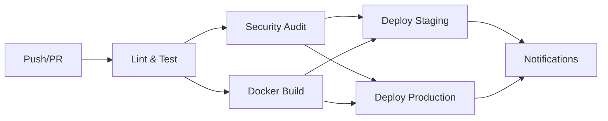

# URL Shortener Service

A modern URL shortening service built with Fastify, TypeScript, and WebSocket for real-time communication.

## Features

- **URL Shortening**: Generate 10-character random codes for long URLs
- **WebSocket Delivery**: Results delivered via WebSocket, not HTTP response
- **Retry Mechanism**: Automatic retry for failed WebSocket message delivery
- **In-Memory Storage**: Fast, asynchronous URL mapping storage
- **Swagger Documentation**: Interactive API documentation
- **Modern TypeScript**: Strict typing with latest TypeScript features
- **Error Handling**: Comprehensive error handling with custom exceptions

## Architecture

- **Fastify**: High-performance HTTP server
- **WebSocket**: Real-time communication for URL shortening results
- **TypeScript**: Type-safe development with strict configuration
- **Zod**: Runtime validation and type inference
- **ESLint + Prettier**: Code quality and formatting

## Prerequisites

- Node.js 18+
- pnpm package manager

## Installation

1. Clone the repository:

```bash
git clone <repository-url>
cd mb-url-shorten
```

2. Install dependencies:

```bash
pnpm install
```

3. Copy environment variables:

```bash
cp .env.example .env
```

4. Configure environment variables in `.env`:

```env
PORT=3000
HOST=0.0.0.0
BASE_URL=http://localhost:3000
WS_PORT=3001
NODE_ENV=development
```

## Development

Start the development server:

```bash
pnpm dev
```

## Production

1. Build the project:

```bash
pnpm build
```

2. Start the production server:

```bash
pnpm start
```

## API Usage

### Shorten URL

**POST** `/url`

Request body:

```json
{
  "url": "https://example.com/very/long/url"
}
```

Response (HTTP):

```json
{
  "message": "URL shortened successfully. Result will be sent via WebSocket."
}
```

Result delivered via WebSocket:

```json
{
  "type": "URL_SHORTENED",
  "messageId": "unique-message-id",
  "data": {
    "shortenedURL": "http://localhost:3000/a2b345w68s"
  }
}
```

### Get Original URL

**GET** `/:code`

Example: `GET /a2b345w68s`

Response:

```json
{
  "url": "https://example.com/very/long/url"
}
```

## WebSocket Communication

1. Connect to WebSocket at `ws://localhost:3001`
2. Send POST request to `/url` endpoint
3. Receive shortened URL via WebSocket
4. Send acknowledgment back to server:

```json
{
  "type": "ACKNOWLEDGMENT",
  "messageId": "unique-message-id"
}
```

## Error Handling

The service includes comprehensive error handling with machine-readable error codes:

- **URL001** (400): Validation errors - Invalid request format or missing fields
- **URL002** (404): URL code not found - Shortened code doesn't exist
- **URL003** (500): Failed to generate unique code - Too many collision attempts
- **URL004** (500): Storage operation failed - Database/memory storage errors

All errors include detailed information:

```json
{
  "message": "Human-readable error description",
  "errorCode": "Machine-readable error code",
  "details": { "additional": "context" },
  "timestamp": "2024-01-01T12:00:00.000Z"
}
```

## Retry Mechanism

- WebSocket messages are automatically retried if not acknowledged
- Maximum 5 retry attempts with 30-second intervals
- Failed messages are logged for debugging

## Testing with WebSocket Client

### Using test-websocket.html

The project includes a ready-to-use HTML WebSocket test client (`test-websocket.html`) for easy testing of the URL shortening service. This interactive tool allows you to test the complete WebSocket flow without writing any code.

#### How to Use:

1. **Start the server**:
   ```bash
   pnpm start
   ```
2. **Open the test client**:
   Open `test-websocket.html` in your web browser (double-click the file or drag it into your browser)

3. **Connect to WebSocket**:

   - Click the "Connect to WebSocket" button
   - Wait for the green "✅ Connected" status

4. **Test URL shortening**:

   - Enter any valid URL (e.g., `https://www.google.com`)
   - Click "Shorten URL" or press Enter
   - Watch the output for real-time WebSocket communication

5. **Test the shortened URL**:
   - Click on the generated shortened URL link
   - Verify it redirects to your original URL

#### What the Test Client Does:

- **Real-time WebSocket communication**: Shows all WebSocket messages in real-time
- **Automatic acknowledgments**: Sends proper acknowledgment messages back to the server
- **Visual feedback**: Color-coded connection status and clickable shortened URLs
- **Error handling**: Displays any connection or communication errors
- **Message logging**: Timestamped log of all WebSocket activity

#### Expected Flow:

1. 🔌 WebSocket connects to `ws://localhost:3001`
2. 📤 HTTP POST request sent to `/url` endpoint
3. ✅ Server responds: "URL shortened successfully. Result will be sent via WebSocket."
4. 📨 WebSocket receives shortened URL message
5. 📤 Client sends acknowledgment back to server
6. 🔗 Clickable shortened URL appears for testing

#### Troubleshooting:

- **Connection fails**: Ensure the server is running (`pnpm start`)
- **CORS errors**: The test client uses `localhost:3000` and `localhost:3001` - make sure these ports are correct
- **WebSocket errors**: Check that port 3001 is available and not blocked by firewall

#### Quick Start Testing:

```bash
# Terminal 1: Start the server
pnpm start

# Browser: Open test-websocket.html
# 1. Click "Connect to WebSocket"
# 2. Enter URL: https://www.example.com
# 3. Click "Shorten URL"
# 4. Click the generated shortened URL to test
```

## API Documentation

Interactive Swagger documentation available at:
`http://localhost:3000/documentation`

### Running Tests

```bash
# Run all tests
pnpm test

# Run only unit tests
pnpm test:unit

# Run only E2E tests
pnpm test:e2e

# Run tests with coverage report
pnpm test:coverage

# Run tests in watch mode during development
pnpm test:watch
```

## CI/CD Pipeline

### GitHub Actions Workflow

The project includes a comprehensive CI/CD pipeline that automatically:

#### **🔍 Quality Assurance (Every Push/PR):**
- **Linting**: ESLint checks for code quality and style
- **Type Checking**: TypeScript compilation validation
- **Testing**: Complete unit and E2E test suite with coverage
- **Security Audit**: Dependency vulnerability scanning
- **Multi-Node Testing**: Tests against Node.js 18.x and 20.x

#### **🐳 Containerization:**
- **Docker Build**: Multi-stage Docker image creation
- **Container Testing**: Health checks and API validation
- **Registry Push**: Automatic push to GitHub Container Registry (main branch)

#### **🚀 Deployment:**
- **Staging**: Auto-deploy to staging on `develop` branch
- **Production**: Auto-deploy to production on `main` branch
- **Notifications**: Deployment status notifications

### Pipeline Stages



### Local CI Simulation

Run the complete CI pipeline locally:

```bash
# Run all CI checks
pnpm ci

# Individual steps
pnpm lint:check       # Check code style
pnpm format:check     # Check formatting
pnpm type-check       # TypeScript validation
pnpm build            # Build project
pnpm test             # Run all tests
pnpm test:coverage    # Generate coverage report
```

### Docker Development

```bash
# Build Docker image
pnpm docker:build

# Run containerized application
pnpm docker:run

# Test Docker image health
curl http://localhost:3000/documentation
```

### Environment Setup for CI/CD

#### Required Secrets (GitHub Repository Settings):

1. **CODECOV_TOKEN**: For code coverage reporting
2. **GITHUB_TOKEN**: Automatically provided for GitHub Actions

#### Optional Secrets for Deployment:

3. **STAGING_HOST**: Staging server hostname
4. **STAGING_USER**: SSH user for staging deployment
5. **STAGING_KEY**: SSH private key for staging access
6. **PRODUCTION_HOST**: Production server hostname  
7. **PRODUCTION_USER**: SSH user for production deployment
8. **PRODUCTION_KEY**: SSH private key for production access

### Branch Strategy

- **`main`**: Production-ready code, triggers production deployment
- **`develop`**: Development branch, triggers staging deployment  
- **`feature/*`**: Feature branches, runs tests only
- **Pull Requests**: Full quality checks required before merge

### Quality Gates

All the following must pass before deployment:

✅ **Code Quality**: ESLint with no errors  
✅ **Formatting**: Prettier formatting compliance  
✅ **Type Safety**: TypeScript compilation success  
✅ **Test Coverage**: All tests passing with coverage reporting  
✅ **Security**: No critical/high vulnerability dependencies  
✅ **Build**: Successful production build  
✅ **Container**: Docker image builds and runs successfully  

### Monitoring & Alerts

The CI/CD pipeline includes:

- **Build Status Badges**: Real-time pipeline status
- **Coverage Reports**: Automated coverage tracking via Codecov
- **Security Alerts**: Dependabot for dependency updates
- **Deployment Notifications**: Success/failure alerts

### Performance Optimization

- **Caching**: Docker layer caching and pnpm cache
- **Parallel Jobs**: Matrix builds for multiple Node.js versions
- **Artifact Storage**: Build artifacts cached between jobs
- **Incremental Testing**: Only run tests for changed files (when configured)

## License

ISC
# mb-url-shortener
